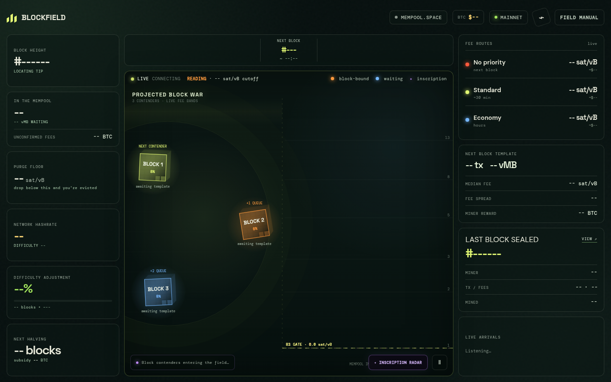

# Blockfield




## At a glance

| | |
|---|---|
| **What it is** | A live Bitcoin mempool visualizer (next-block fee wars + inscriptions). |
| **What it’s for** | See fee pressure and inscription activity at a glance. |
| **How to use it** | ./setup.sh or open index.html; optional ?node= for your mempool. |

## Try it

### One command
```bash
git clone https://github.com/Coinupbtc/bitcoin-blockfield.git
cd bitcoin-blockfield && ./setup.sh
```

A self-contained, responsive Bitcoin mempool visualization. It uses the public mempool.space API in the browser for the current block, mempool, and fee estimates; if the API is unavailable, it keeps a clearly labelled local fallback state.

## Run it

Open `index.html` in a browser, or serve the directory with any static file server:

```bash
cd /path/to/bitcoin-blockfield
python3 -m http.server 8080
```

Then visit `http://localhost:8080`.

## Run it against your own node

Blockfield reads a mempool.space-compatible REST/WS API, so it can run entirely
off a self-hosted node (Start9 **Mempool** service, Umbrel, or any mempool.space
install). Three ways to point it at yours:

- Click the **data-source badge** in the top bar and paste your node URL, or
- add `?node=https://mempool.your-start9.local` (or `?api=`) to the URL, or
- it remembers the last node you set (via `localStorage`).

The `/api` suffix is added automatically. If your node stops responding it falls
back to the public mempool.space API and flags the badge **NODE UNREACHABLE**.
Block/tx links and the live combat feed all resolve against whichever source is
active.

## What's on the field (v7)

Single-screen console — everything fits one viewport, no scrolling (it falls back
to a stacked scroll layout under ~1180px / on mobile).

**Projected Block War** (centre). The next three mempool block templates are
full-size moving contenders. Their capacity, transaction count, median fee, colour,
and fee gate are live data; their 3D movement, ricochets, collision sparks, and
body-check combat feed are the arcade layer. Transactions steer toward Block 1, 2,
or 3 according to the real projected fee bands, while anything below all three
gates waits in the mempool.

**Inscription Radar.** Paste a mempool.space transaction URL or txid to put its
on-chain image into the field. The featured unconfirmed GIF transaction is loaded
on startup, and the radar rate-limits a scan of large live arrivals. Blockfield
decodes Ordinals envelopes directly from transaction witness data, so previews work
before an indexer sees the inscription. Only a safe image MIME allowlist is rendered;
HTML and SVG payloads are not executed. Hover a card for media, size, fee, and
confirmation state; click it to open the transaction.

**Block chain strip** — the next 3 projected templates and last 5 confirmed blocks.

**Left rail (network):** height, mempool size + unconfirmed fees, purge floor,
hashrate, **difficulty adjustment** (change %, progress, ETA), **halving countdown**
+ current subsidy.

**Right rail:** fee routes with **fiat cost per typical tx** (needs live price),
next-block template (tx / vMB / median / spread / miner reward), last block, and a
live arrivals ticker. BTC price sits in the top bar.

Block-found flash, event sound toggle, pause control, responsive sizing, and
`prefers-reduced-motion` support are retained.
